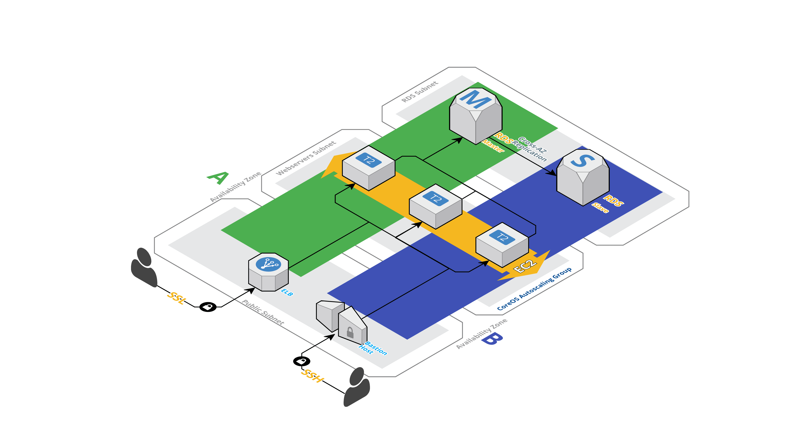

ConvertKit Challenge
============

| Candidate | Role |
|---|---|
| Lucas do Amaral Saboya | Infrastructure Engineer |

### Assignment Description
> Hi Lucas,
>
> Thanks for your patience in this process. As we mentioned, we have a homework assignment as part of our hiring process. We have created a new AWS account for you to stand up a production environment for a minimal Ruby on Rails application. The source for the application is at https://github.com/ConvertKit/ck-infra-homework. However you choose to treat this application as production is up to you. You should use it as an opportunity to demonstrate your skillset with AWS, infrastructure as code, resiliency or any other proficiency you would like to highlight.
>
> The time limit is 10 hours and we ask you to self-enforce this limit. You'll likely have to make tradeoffs to complete the assignment. Please keep a history of what those tradeoffs are. For the Rails app, there is a seed database in db/seeds.rb. The root URL of the Rails app will show the seed data on the page. We do expect to see a separate resource/server for the database.
>
> And that's it! The credentials for the account are available at https://onetimesecret.com/secret/4ehcsdd9trb6h7u5n... (link expires in 7 days). Please let me know if you have any issues with the AWS account or have any questions.
>
> All Best,
>
> Johnny

### Chosen Stack - A spartan approach
With the following assigment at hand, there are several ways I could do this. First, I had to choose wether or not I'll be using any AWS services for deployment, such as OpsWorks, Beanstalk or Elastic Container Service - ECS or even Elastic Kubertnetes Service - EKS . Since I've been requested to add as much code and documentation as possible, those were out of the equation simply because those solutions are either entirely driven through the UI (OpsWorks/Beanstak) or present poor legibilty at first look by another set of eyes if written in code(OpsWorks/Beanstalk/ECS/EKS).

As this is a pretty simple setup (All it was requested was an rails application deployed that talk to a database), I figured I  can leverage `CoreOS Container Linux`, `cloud-init`/`cloud-config`, `systemd` and `docker` to spin up our application, an multi-az Relational Database Service - RDS instance for the application to connect to and an Elastic Load Balancer - ELB to route requests to the Elastic Compute Cloud - EC2 Instances as well as do SSL termination.

Here's an overview of how it all fits together. You can check out how terraform configures this assignment's VPC [here](https://github.com/lucazz/ck-infra-homework/blob/master/terraform/README.md):

And the tool I picked for deploying our project to AWS is [Terraform](https://www.terraform.io/), an infrastructure as code software by HashiCorp. It allows users to define a datacenter infrastructure in a high-level configuration language, from which it can create an execution plan to build the infrastructure in a service provider such as AWS.

### Requirements
 - [AWS CLI](https://aws.amazon.com/cli/)
 - [Cloudflare's cfssl](https://github.com/cloudflare/cfssl)
 - [Terraform 0.11.10+](https://www.terraform.io/downloads.html)
 - GNU Make (For running locally only)
 - Docker (For running locally only)

### Deploying this stack localy
In order to deploy this stack localy, you can just use the `Makefile` to get it running:

    make build
    make run
    
The app can be reached on [http://localhost:3000](http://localhost:3000). You can check out all the other stuff you can do w/ our `Makefile` by issuing a `make` at the root of the repo.

### Deploying this stack to Production
I've already built and pushed (`make build` and `make push`) this app into a docker image. [You can check it out here](https://hub.docker.com/r/lucazz/convertkit/). In order to save us some time, we'll be using this image to deploy our application. 

In order to deploy this stack, you have to generate our SSL certficates first. To do so, cd into the `terraform/cfssl/` directory and generate our own self-signed CA e certs:

    cd terraform/modules/ssl/cfssl/
    cfssl genkey -initca ca-csr.json | cfssljson -bare ca
    cfssl gencert \
        -ca=ca.pem \
        -ca-key=ca-key.pem \
        -config=ca-config.json \
        -profile=convertkit \
    ca-csr.json | cfssljson -bare convertkit

You can re-generate either the CA's or the certs as much as you want. Terraform will [pick those up from this directory and upload them to AWS](https://github.com/lucazz/ck-infra-homework/blob/master/terraform/modules/ssl/main.tf) for you.
The next step here is to configure out `AWS_ACCESS_KEY` and `AWS_SECRET_KEY` with AWS-cli. To do so, simply run the following command:

    aws configure --profile=convertkit

Note: Pay close attention to the fact that we're using the following profile name: `convertkit` [Terraform looks up and uses this profile](https://github.com/lucazz/ck-infra-homework/blob/master/terraform/config-aws.tf#L3) to interact with AWS's API so please, so don't forget to add it.

Terraform is an idempotent tool, meaning it won't make changes to the infrastructure if those are not required. The way it determines wether or not something needs to change is by building a graph of all the changes the HCL code and matching this graph with what it calls the state file. You can learn more about it [here](https://www.terraform.io/docs/state/index.html).

The way terraform manages state across all members of a team is pretty simple, I've set up an S3 bucket in which terraform will store a copy of the state the last run converged to. So, when new team members join, all they need to do is pull a copy of the state from that bucket. To do so, you'll need to cd into the `terraform/` directory and run the following commands:

    cd terraform
    terraform init
    terraform remote pull
    terraform plan
    terraform apply -var db_password=L337_53CR37 -var secret_key_name=4N07H3R_L337_53CR37
    
Be mindfull that ALL variables can be overriden at runtime using `-var` flags. For a list of all variables used and their defaults, [click here](https://github.com/lucazz/ck-infra-homework/blob/master/docs/VARIABLES.md) 
That'll install the required terraform modules/plugins, fetch the state from the S3 bucket and check if there's any changes that need to be made based on the contents of our HCL files.
If there's any change we need to make in our infrastructure, all we need to do is run:

    cd terraform
    terraform apply

After running the terraform apply command, you'll be greeted with the ELB's url:

    Do you want to perform these actions?
      Terraform will perform the actions described above.
      Only 'yes' will be accepted to approve.
    
      Enter a value: yes
    
    module.rds.aws_db_instance.convertkit: Destroying... (ID: terraform-20181114174632184000000001)
    module.ssl.aws_iam_server_certificate.convertkit: Creating...
      arn:              "" => "<computed>"
      certificate_body: "" => "8957fc226e7555743bf8736c2e4e349e49ace5ce"
      name:             "" => "convertkit-ssl-certificate"
      path:             "" => "/"
      private_key:      "<sensitive>" => "<sensitive>"
    module.vpc.aws_security_group.elb: Creating...
    [...]
    module.vpc.aws_route_table.nodes: Modifications complete after 2s (ID: rtb-0c054328a70568449)
    module.vpc.aws_route_table.rds: Modifications complete after 2s (ID: rtb-01da5a6a821647da1)
    module.vpc.aws_security_group_rule.allow_internal_traffic: Creation complete after 2s (ID: sgrule-2795479202)

    Apply complete! Resources: 1 added, 2 changed, 1 destroyed.

    Outputs:

    ELB_URL = https://convertkit-951420652.us-east-1.elb.amazonaws.com

You're all set!

You can just hit that URL, for instance in this example:
[https://convertkit-951420652.us-east-1.elb.amazonaws.com/](https://convertkit-951420652.us-east-1.elb.amazonaws.com/)

### Cleaning up after yourself

Cleaning up this stack is faily easy, all you gotta do is issue a: 

    terraform destroy

### References
 - https://en.wikipedia.org/wiki/Terraform_(software)
 - https://daringfireball.net/projects/markdown/syntax
 - https://docs.docker.com/engine/reference/commandline/run/
 - https://coreos.com/validate/
 - https://access.redhat.com/documentation/en-us/red_hat_enterprise_linux/7/html/system_administrators_guide/sect-managing_services_with_systemd-unit_files
 - https://cloudinit.readthedocs.io/en/latest/
 - https://coreos.com/os/docs/latest/cloud-config.html
 - https://ncona.com/2017/09/getting-rails-to-run-in-an-alpine-container/
 - https://www.redmine.org/issues/25241
 - https://github.com/fluent/fluentd-ui/issues/214#issuecomment-424250558
 - https://github.com/ffi/ffi/issues/485#issuecomment-209778567<Paste>
